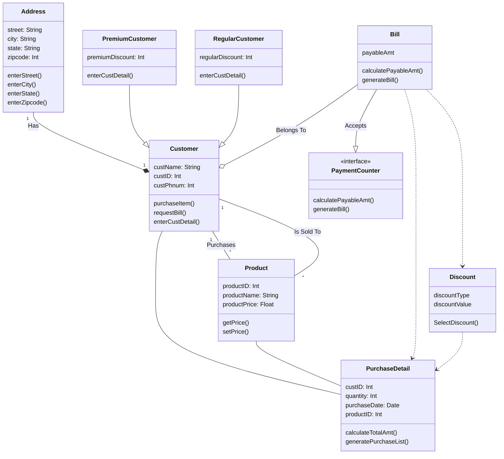

```mermaid
classDiagram

Address "1" --* "1" Customer : Has
Customer "1" -- "*" Product : Purchases
Product "*" -- "1" Customer : Is Sold To
Customer -- PurchaseDetail
Product -- PurchaseDetail
PremiumCustomer --|> Customer
RegularCustomer --|> Customer
Bill --o Customer : Belongs To
Bill ..> PurchaseDetail
Bill ..> Discount
Discount ..> PurchaseDetail
Bill --|> PaymentCounter : Accepts

class Address{
    street: String
    city: String
    state: String
    zipcode: Int
    enterStreet()
    enterCity()
    enterState()
    enterZipcode()
}

class Product{
    productID: Int
    productName: String
    productPrice: Float
    getPrice()
    setPrice()
}

class Customer{
    custName: String
    custID: Int
    custPhnum: Int
    purchaseItem()
    requestBill()
    enterCustDetail()
}

class PremiumCustomer{
    premiumDiscount: Int
    enterCustDetail()
}

class RegularCustomer{
    regularDiscount: Int
    enterCustDetail()
}

class PurchaseDetail{
    custID: Int
    quantity: Int
    purchaseDate: Date
    productID: Int
    calculateTotalAmt()
    generatePurchaseList()
}

class Discount{
    discountType
    discountValue
    SelectDiscount()
}

class Bill{
    payableAmt
    calculatePayableAmt()
    generateBill()
}

class PaymentCounter{
    <<interface>>
    calculatePayableAmt()
    generateBill()
}

```
