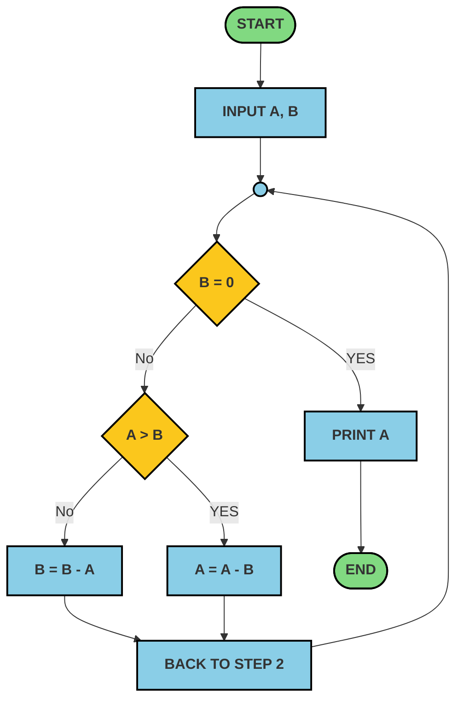

### Euclide GCD

> Ước chung lớn nhất của 2 số tự nhiên A, B

```mermaid
graph TD
    start([START]) --> step1[INPUT A, B]
    step1 --> tinyCircle(( ))
    tinyCircle --> step2{B = 0}
    step2 -- No --> step3{A > B}
    step3 -- No --> step4[B = B - A]
    step3 -- YES --> step5[A = A - B]
    step2 -- YES --> step6[PRINT A]
    step4 --> goto2[BACK TO STEP 2]
    step5 --> goto2
    step6 --> finish([END])
    goto2 --> tinyCircle

    classDef yellow fill:#fbc71c,stroke-width:2px,stroke:#000,font-size:16px,font-weight:bold
    classDef cyan fill:#8acee7,stroke-width:2px,stroke:#000,font-size:16px,font-weight:bold
    classDef green fill:#81d981,stroke-width:2px,stroke:#000,font-size:16px,font-weight:bold
    class step1,tinyCircle,step4,step5,step6,goto2 cyan
    class step2,step3 yellow
    class start,finish green
```
