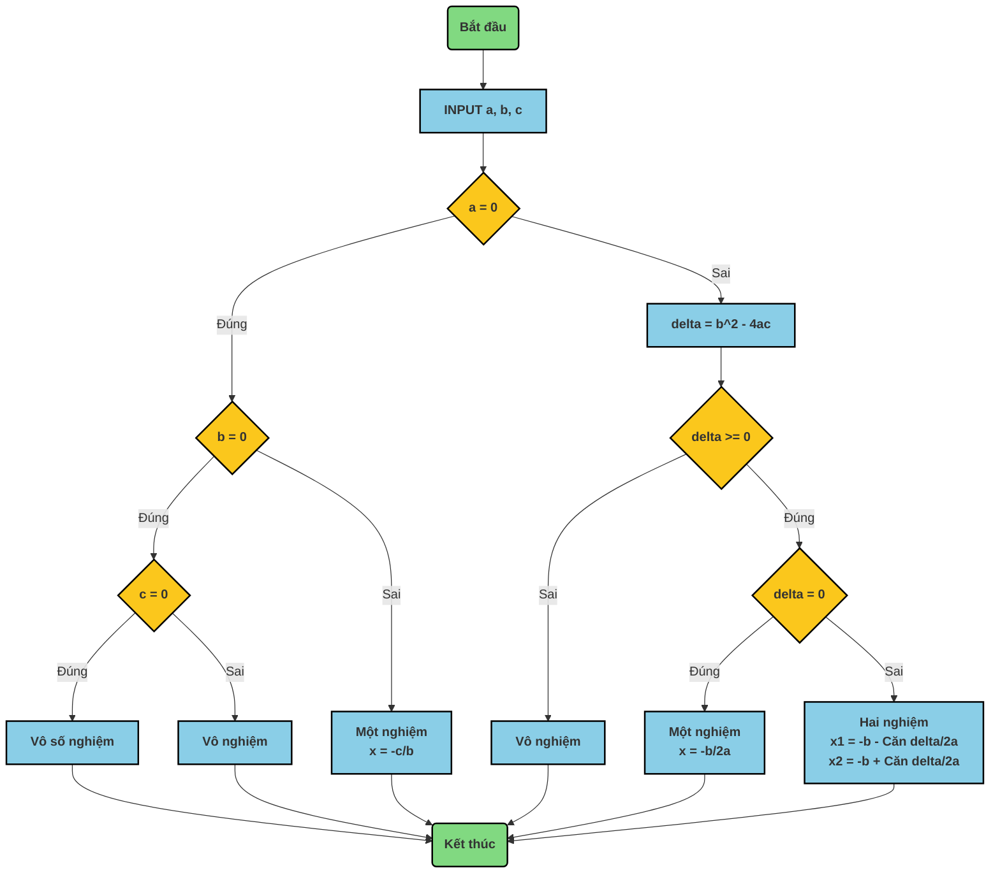

### Quadratic Equation

> ax2 + bx + c = 0

```mermaid
graph TD
    start(Bắt đầu) --> step1[INPUT a, b, c]
    step1 --> step2{a = 0}
    step2 -- Đúng --> step3{b = 0}
    step3 -- Đúng --> step4{c = 0}
    step4 -- Đúng --> resultR[Vô số nghiệm]
    step4 -- Sai --> result01[Vô nghiệm]
    step3 -- Sai --> result11[Một nghiệm<br>x = -c/b <br>]
    step2 -- Sai --> step5[delta = b^2 - 4ac]
    step5 --> step6{delta >= 0}
    step6 -- Sai --> result02[Vô nghiệm]
    step6 -- Đúng --> step7{delta = 0}
    step7 -- Đúng --> result12[Một nghiệm<br>x = -b/2a]
    step7 -- Sai --> result2[Hai nghiệm<br>x1 = -b - Căn delta/2a<br>x2 = -b + Căn delta/2a]

    resultR --> finish(Kết thúc)
    result01 --> finish
    result02 --> finish
    result11 --> finish
    result12 --> finish
    result2 --> finish

    classDef yellow fill:#fbc71c,stroke-width:2px,stroke:#000,font-size:16px,font-weight:bold
    classDef cyan fill:#8acee7,stroke-width:2px,stroke:#000,font-size:16px,font-weight:bold
    classDef green fill:#81d981,stroke-width:2px,stroke:#000,font-size:16px,font-weight:bold
    class step1,step5,resultR,result01,result02,result11,result12,result2 cyan
    class step2,step3,step4,step6,step7 yellow
    class start,finish green
```
