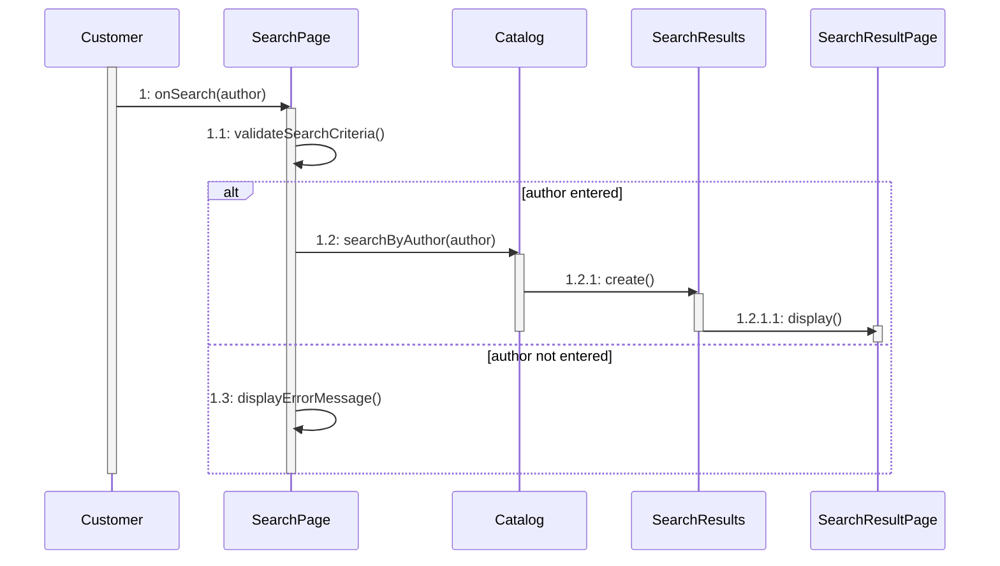

## Sequence Diagram

**Search Book : Use Case**

- **Main scenario**
  1. The Customer specifies an author on the Search Page and then presses the Search button.
  1. The system validates the Customer's search criteria.
  1. If author is entered, the System searches the Catalog for books associated with the specified author.
  1. When the search is complete, the system displays the search results on the Search Results page.
- **Altenate path**
  If the Customer did not enter the name of an author before pressing the Search button, the System displays an error message

