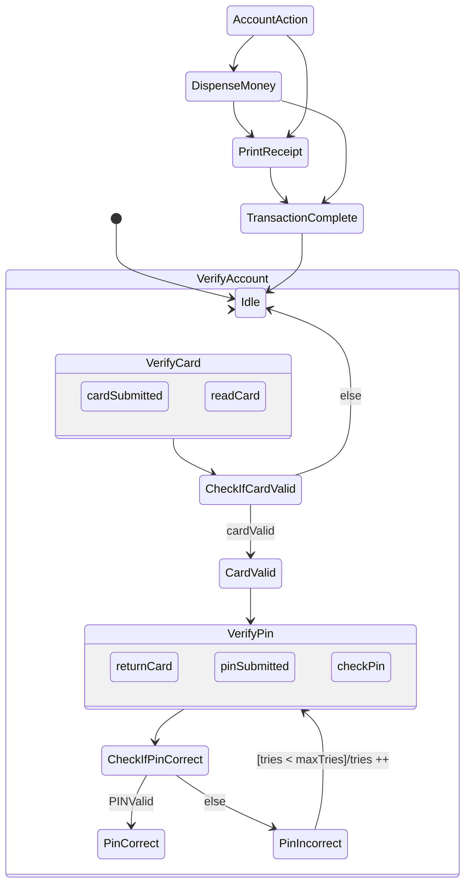

## State Chart Diagram

> ATM Machine State Diagram

```mermaid
stateDiagram
[*] --> Idle
Idle --> VerifyAccount
state VerifyAccount {
    state VerifyCard {
        cardSubmitted
        readCard
        returnCard
    }

    VerifyCard --> CheckIfCardValid
    CheckIfCardValid --> Idle : else
    CheckIfCardValid --> CardValid : cardValid
    CardValid --> VerifyPin
    state VerifyPin {
        pinSubmitted
        checkPin
        returnCard
    }
    VerifyPin --> CheckIfPinCorrect
    CheckIfPinCorrect --> PinCorrect : PINValid
    CheckIfPinCorrect --> PinIncorrect : else
    PinIncorrect --> VerifyPin : [tries < maxTries]/tries ++
}

TransactionComplete --> Idle
PrintReceipt --> TransactionComplete
DispenseMoney --> PrintReceipt
DispenseMoney --> TransactionComplete
AccountAction --> DispenseMoney
AccountAction --> PrintReceipt

```
